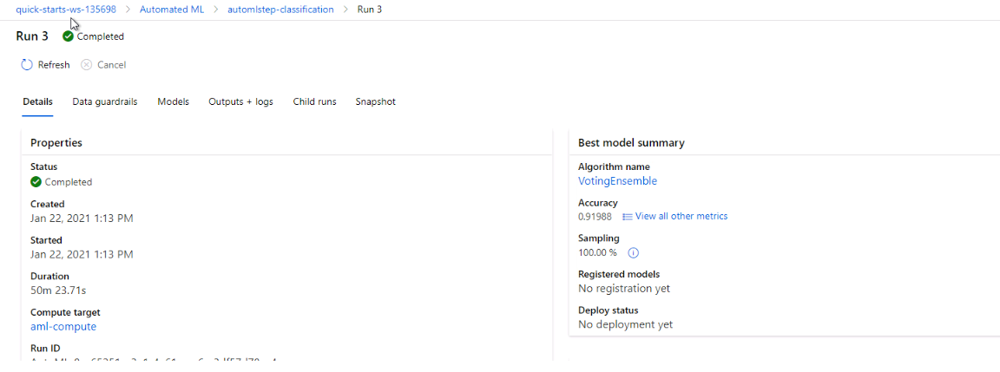
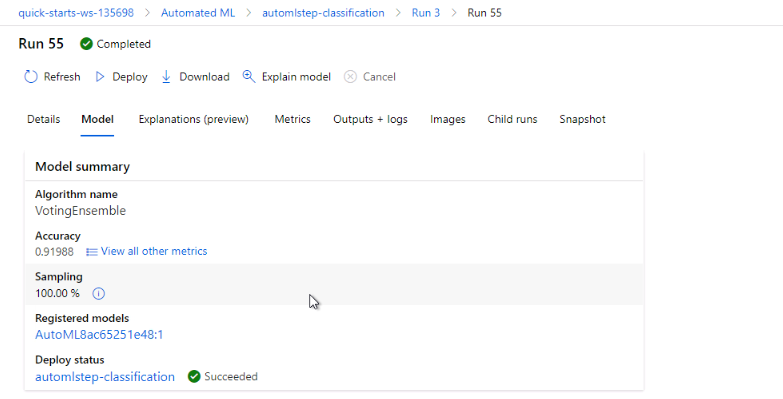

*NOTE:* This file is a template that you can use to create the README for your project. The *TODO* comments below will highlight the information you should be sure to include.

# Operationalizing Machine Learning for Bank Marketing Dataset

## Overview 
This project is part of the Udacity Azure ML Nanodegree. In this project, we deploy a model, consume endpoints to interact with the deployed model in Azure ML Studio and perform pipeline automation to improve machine learning operations.

## Architectural Diagram

*TODO*: Provide an architectual diagram of the project and give an introduction of each step. An architectural diagram is an image that helps visualize the flow of operations from start to finish. In this case, it has to be related to the completed project, with its various stages that are critical to the overall flow. For example, one stage for managing models could be "using Automated ML to determine the best model". 
## Key Steps

### 1. Authentication: 
This step plays a key role in maintaining a uninterrupted flow of operations. Human intervention slows down the process. Therefore, authentication with automation is considered as an ideal scenario. A 'Service Principal' is one of the best examples of authentication with user specific permissions.

### 2. Automated ML Experiment
In order to create an AutoML experiment, we first login into the AzureML portal and create a new compute for the new experiment. The virtual machine size chosen for the compute cluster is 'Standard_DS12_v2' with 1 as the minimum number of nodes. The experiment takes about 1 hour for completion with concurrency of 5. 

#### Registered Datasets

#### AutoML experiment completion

#### Best Model: VotingEnsemble

### 3. Deploy the best model
The best model obtained in the AutoML run is 'VotingEnsemble' with the highest accuracy of 0.91988. In order to deploy, we choose the best model, enable authentication and use Azure Container Instance (ACI) as it quickly deploy compute instances and is simple to use as well.

## Screen Recording
*TODO* Provide a link to a screen recording of the project in action. Remember that the screencast should demonstrate:

## Standout Suggestions
*TODO (Optional):* This is where you can provide information about any standout suggestions that you have attempted.

