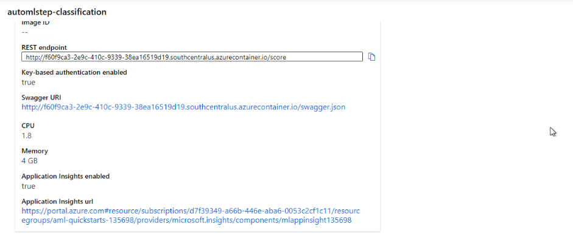

*NOTE:* This file is a template that you can use to create the README for your project. The *TODO* comments below will highlight the information you should be sure to include.

# Operationalizing Machine Learning for Bank Marketing Dataset

## Overview 
This project is part of the Udacity Azure ML Nanodegree. In this project, we deploy a model, consume endpoints to interact with the deployed model in Azure ML Studio and perform pipeline automation to improve machine learning operations.

## Architectural Diagram

*TODO*: Provide an architectual diagram of the project and give an introduction of each step. An architectural diagram is an image that helps visualize the flow of operations from start to finish. In this case, it has to be related to the completed project, with its various stages that are critical to the overall flow. For example, one stage for managing models could be "using Automated ML to determine the best model". 
## Key Steps

### 1. Authentication: 
This step plays a key role in maintaining a uninterrupted flow of operations. Human intervention slows down the process. Therefore, authentication with automation is considered as an ideal scenario. A 'Service Principal' is one of the best examples of authentication with user specific permissions.

### 2. Automated ML Experiment
In order to create an AutoML experiment, we first login into the AzureML portal and create a new compute for the new experiment. The virtual machine size chosen for the compute cluster is 'Standard_DS12_v2' with 1 as the minimum number of nodes. The experiment takes about 1 hour for completion with concurrency of 5. 

#### Registered Datasets

#### AutoML experiment completion

#### Best Model: VotingEnsemble

### 3. Deploy the best model
Deployment is the delivery of the best trained model into production so that it can be consumed by others. The best model obtained in the AutoML run is 'VotingEnsemble' with the highest accuracy of 0.91988. In order to deploy, we configure the deployment settings by enabling authentication and using Azure Container Instance (ACI) as it quickly deploys compute instances and is simple to use.

### 4. Enable logging
This is a crucial step to 'Enable Application Insights'. Application insights is a tool that helps in detecting anomalies and visualizing performance. It can be enabled before or after deployment and can be modified with the SDK. In this project, we enable application insights after deployment by adding a specific command to the python SDK. The modified python script displaying logs.

#### Application Insights Enabled

#### Python SDK run

### 4. Swagger Documentation
Swagger is a tool that helps build, document, and consume RESTful web services deployed in Azure ML Studio. It further explains what types of HTTP requests an API can consume, in this case like POST and GET. A swagger.json is provided in the endpoints section of Azure that is used to create a web site. This localhost website documents the HTTP endpoint for a deployed model. After running the swagger.sh and serve.py scripts, the webpage displays the contents of the API for the model along with different HTTP requests supported.

#### Swagger Website 

#### serve.sh script run on port 8000

#### API Contents

### 5. Consume Model Endpoints

In this project, the deployed service is consumed via an HTTP API. We initiate an input request, in this case via an HTTP POST request method to submit data. The HTTP GET is another request method to retrieve information from a web server. This creates a bi-directional flow of allowed information in Azure. 
In order to consume deployed service, we modify the URI and key to match the primary key for our service and RESTful URI generated after deployment. The execution of the endpoint.py script after modification gives a JSON output.

#### API for the Model

#### Consume endpoint

The APIs exposed by Azure ML will use JSON (JavaScript Object Notation) to accept data and submit responses. It served as a bridge language among different environments.

## Screen Recording
*TODO* Provide a link to a screen recording of the project in action. Remember that the screencast should demonstrate:

## Standout Suggestions
*TODO (Optional):* This is where you can provide information about any standout suggestions that you have attempted.

